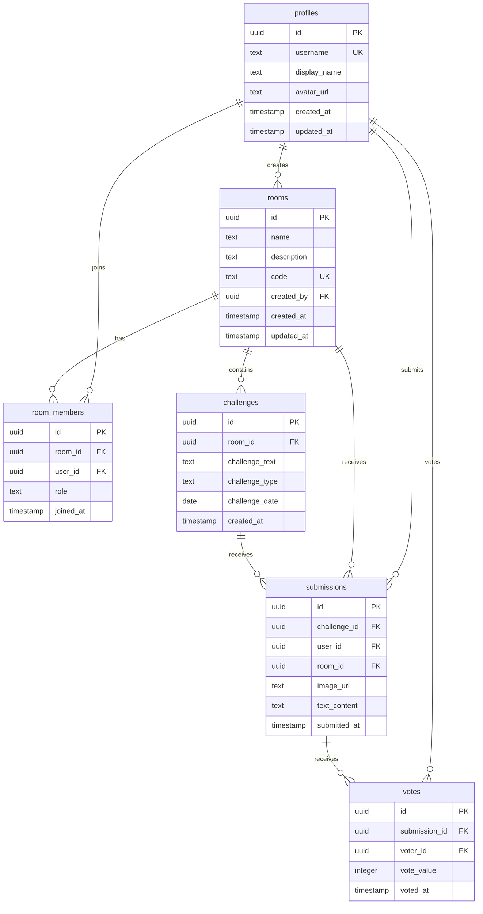
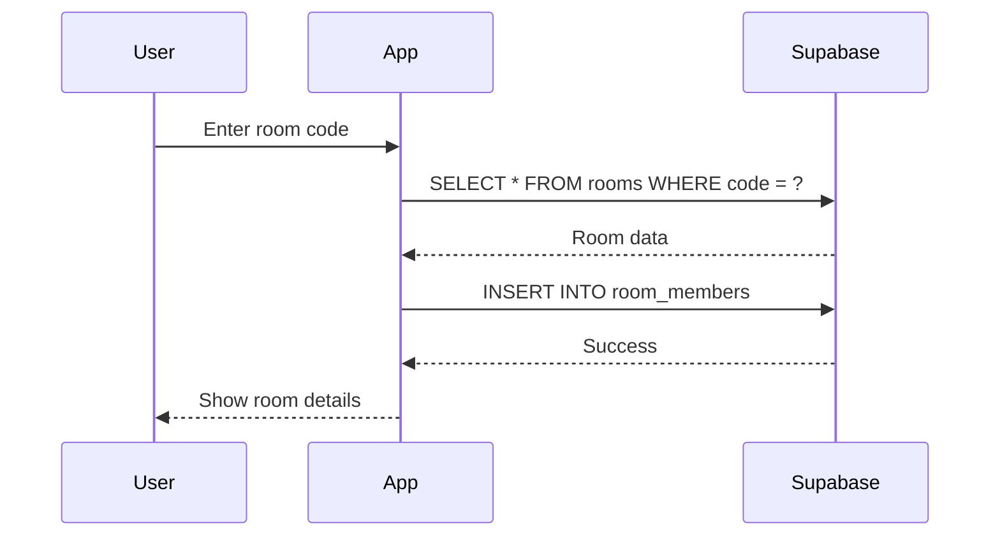
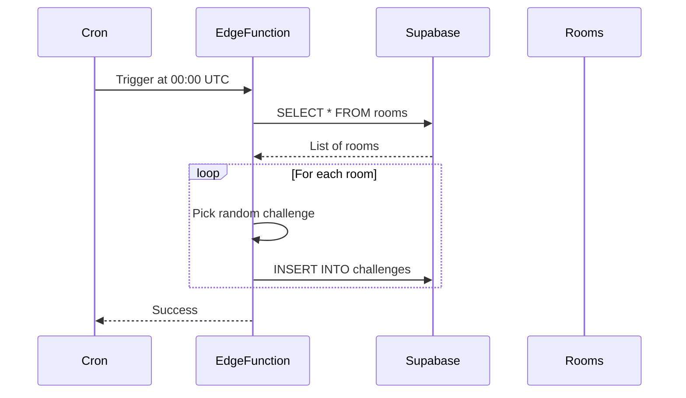
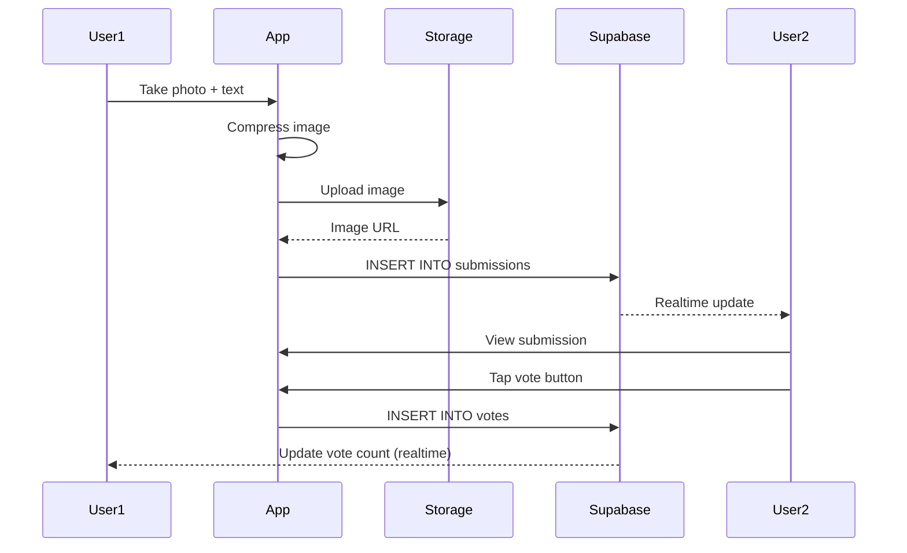
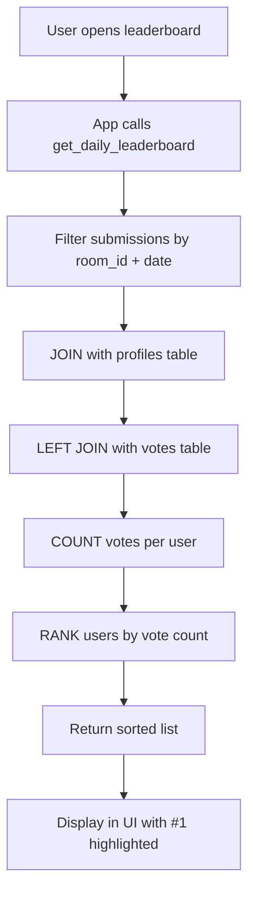
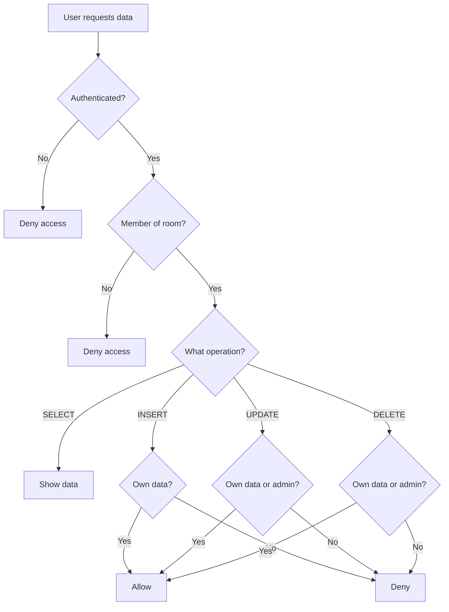

# Database Schema Diagram

## Entity Relationship Diagram



## Table Relationships

### 1. profiles → rooms (One-to-Many)
- One user can **create** multiple rooms
- Each room has one creator
- Relationship: `rooms.created_by → profiles.id`

### 2. profiles ↔ rooms (Many-to-Many via room_members)
- One user can **join** multiple rooms
- One room can have multiple members
- Junction table: `room_members`
- Relationships:
  - `room_members.user_id → profiles.id`
  - `room_members.room_id → rooms.id`

### 3. rooms → challenges (One-to-Many)
- One room has multiple challenges (one per day)
- Each challenge belongs to one room
- Relationship: `challenges.room_id → rooms.id`
- Unique constraint: `(room_id, challenge_date)`

### 4. challenges → submissions (One-to-Many)
- One challenge can have multiple submissions
- Each submission belongs to one challenge
- Relationship: `submissions.challenge_id → challenges.id`
- Unique constraint: `(challenge_id, user_id)` - one submission per user per challenge

### 5. profiles → submissions (One-to-Many)
- One user can make multiple submissions
- Each submission belongs to one user
- Relationship: `submissions.user_id → profiles.id`

### 6. submissions → votes (One-to-Many)
- One submission can receive multiple votes
- Each vote belongs to one submission
- Relationship: `votes.submission_id → submissions.id`
- Unique constraint: `(submission_id, voter_id)` - one vote per user per submission

### 7. profiles → votes (One-to-Many)
- One user can cast multiple votes
- Each vote is cast by one user
- Relationship: `votes.voter_id → profiles.id`

---

## Data Flow Diagrams

### User Joins Room Flow



### Daily Challenge Generation Flow



### Submission & Voting Flow



### Leaderboard Calculation Flow



---

## Database Indexes

Indexes are created to optimize common queries:

| Table | Index | Purpose |
|-------|-------|---------|
| `rooms` | `idx_rooms_code` | Fast room lookup by code (JOIN) |
| `rooms` | `idx_rooms_created_by` | List rooms created by user |
| `room_members` | `idx_room_members_room_id` | List members of a room |
| `room_members` | `idx_room_members_user_id` | List rooms a user belongs to |
| `challenges` | `idx_challenges_room_date` | Get today's challenge for room |
| `submissions` | `idx_submissions_challenge_id` | List submissions for challenge |
| `submissions` | `idx_submissions_user_id` | List user's submissions |
| `submissions` | `idx_submissions_room_id` | List submissions in room |
| `votes` | `idx_votes_submission_id` | Count votes for submission |
| `votes` | `idx_votes_voter_id` | List votes by user |

---

## Sample Data

### Example: Room with Daily Challenge

```sql
-- Room
INSERT INTO rooms (id, name, code, created_by) 
VALUES ('room-1', 'Friends Group', 'ABC123', 'user-1');

-- Room Members
INSERT INTO room_members (room_id, user_id, role) VALUES
('room-1', 'user-1', 'admin'),
('room-1', 'user-2', 'member'),
('room-1', 'user-3', 'member');

-- Today's Challenge
INSERT INTO challenges (id, room_id, challenge_text, challenge_type, challenge_date)
VALUES ('challenge-1', 'room-1', 'Take the most cringe photo today.', 'photo', CURRENT_DATE);

-- Submissions
INSERT INTO submissions (id, challenge_id, user_id, room_id, image_url) VALUES
('sub-1', 'challenge-1', 'user-1', 'room-1', 'https://...image1.jpg'),
('sub-2', 'challenge-1', 'user-2', 'room-1', 'https://...image2.jpg'),
('sub-3', 'challenge-1', 'user-3', 'room-1', 'https://...image3.jpg');

-- Votes
INSERT INTO votes (submission_id, voter_id, vote_value) VALUES
-- User 2 votes for User 1's submission
('sub-1', 'user-2', 1),
-- User 3 votes for User 1's submission
('sub-1', 'user-3', 1),
-- User 1 votes for User 2's submission
('sub-2', 'user-1', 1);

-- Result: User 1 has 2 votes, User 2 has 1 vote, User 3 has 0 votes
-- Winner: User 1
```

---

## Row Level Security (RLS) Visual



### RLS Policy Examples

**Example 1: Users can only view submissions in rooms they're members of**
```sql
CREATE POLICY "Users can view submissions in their rooms"
  ON public.submissions FOR SELECT
  USING (
    EXISTS (
      SELECT 1 FROM public.room_members
      WHERE room_members.room_id = submissions.room_id
        AND room_members.user_id = auth.uid()
    )
  );
```

**Example 2: Users cannot vote on their own submissions**
```sql
CREATE POLICY "Users can vote on submissions"
  ON public.votes FOR INSERT
  WITH CHECK (
    auth.uid() = voter_id AND
    NOT EXISTS (
      SELECT 1 FROM public.submissions
      WHERE submissions.id = votes.submission_id
        AND submissions.user_id = auth.uid()
    )
  );
```

---

## Storage Structure

```
challenge-images/  (bucket)
├── submissions/
│   ├── user-1/
│   │   ├── submission-1-1675234567890.jpg
│   │   ├── submission-2-1675320967890.jpg
│   │   └── ...
│   ├── user-2/
│   │   ├── submission-3-1675234567890.jpg
│   │   └── ...
│   └── ...
```

**Storage Policies:**
- Authenticated users can **upload** to their own folder
- Authenticated users can **update/delete** their own images
- Public can **read** all images (for viewing submissions)

---

## Query Performance Tips

### 1. Use Indexes
All foreign keys are indexed automatically. Additional indexes on frequently queried columns improve performance.

### 2. Avoid N+1 Queries
```sql
-- ❌ BAD: Multiple queries
SELECT * FROM submissions WHERE room_id = ?;
-- Then for each submission:
SELECT * FROM profiles WHERE id = submission.user_id;

-- ✅ GOOD: Single query with JOIN
SELECT s.*, p.username, p.avatar_url 
FROM submissions s
JOIN profiles p ON s.user_id = p.id
WHERE s.room_id = ?;
```

### 3. Use Materialized Views for Leaderboards (Future Optimization)
```sql
CREATE MATERIALIZED VIEW daily_leaderboard AS
SELECT 
  s.room_id,
  s.user_id,
  c.challenge_date,
  COUNT(v.id) AS total_votes
FROM submissions s
JOIN challenges c ON s.challenge_id = c.id
LEFT JOIN votes v ON s.id = v.submission_id
GROUP BY s.room_id, s.user_id, c.challenge_date;

-- Refresh daily
REFRESH MATERIALIZED VIEW daily_leaderboard;
```

---

## Database Size Estimation

For **1000 active users** with **100 rooms**:

| Table | Est. Rows | Size per Row | Total Size |
|-------|-----------|--------------|------------|
| profiles | 1,000 | 500 bytes | 500 KB |
| rooms | 100 | 300 bytes | 30 KB |
| room_members | 5,000 | 200 bytes | 1 MB |
| challenges | 3,650 | 400 bytes | 1.5 MB |
| submissions | 36,500 | 500 bytes | 18 MB |
| votes | 365,000 | 200 bytes | 73 MB |
| **Total** | | | **~94 MB** |

**Storage (Images):**
- Average image size: 500 KB (after compression)
- 36,500 submissions/year × 500 KB = **18 GB/year**

**Supabase Free Tier:**
- Database: 500 MB ✅
- Storage: 1 GB ✅ (sufficient for MVP)
- Bandwidth: 2 GB ✅

**Recommendation:** Free tier is sufficient for MVP with up to 100 users.

---

## Backup Strategy

### Automated Backups (Supabase)
- Daily automatic backups (retained for 7 days on free tier)
- Point-in-time recovery available on paid plans

### Manual Backup
```bash
# Using Supabase CLI
supabase db dump -f backup.sql

# Or using pg_dump
pg_dump -h db.xxxxx.supabase.co -U postgres -d postgres > backup.sql
```

### Restore
```bash
psql -h db.xxxxx.supabase.co -U postgres -d postgres < backup.sql
```

---

## Monitoring & Analytics

### Key Metrics to Track

1. **User Engagement**
   - Daily active users (DAU)
   - Weekly active users (WAU)
   - Submission rate (submissions per user per day)
   - Voting rate (votes per user per day)

2. **Performance**
   - API response times
   - Image upload success rate
   - Query performance (slow queries)

3. **Growth**
   - New user signups
   - New rooms created
   - Room size distribution

### SQL Query Examples

```sql
-- Daily active users
SELECT COUNT(DISTINCT user_id) 
FROM submissions 
WHERE submitted_at >= CURRENT_DATE;

-- Average votes per submission
SELECT AVG(vote_count) FROM (
  SELECT submission_id, COUNT(*) as vote_count
  FROM votes
  GROUP BY submission_id
) subquery;

-- Most active rooms
SELECT r.name, COUNT(s.id) as submission_count
FROM rooms r
JOIN submissions s ON r.id = s.room_id
WHERE s.submitted_at >= CURRENT_DATE - INTERVAL '7 days'
GROUP BY r.id, r.name
ORDER BY submission_count DESC
LIMIT 10;
```

---

This diagram provides a visual understanding of the database structure. For implementation details, see **[database_schema.sql](database_schema.sql)**.
